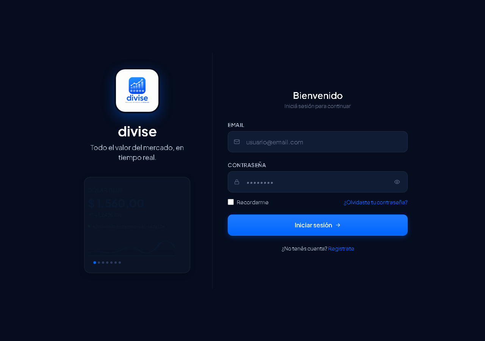
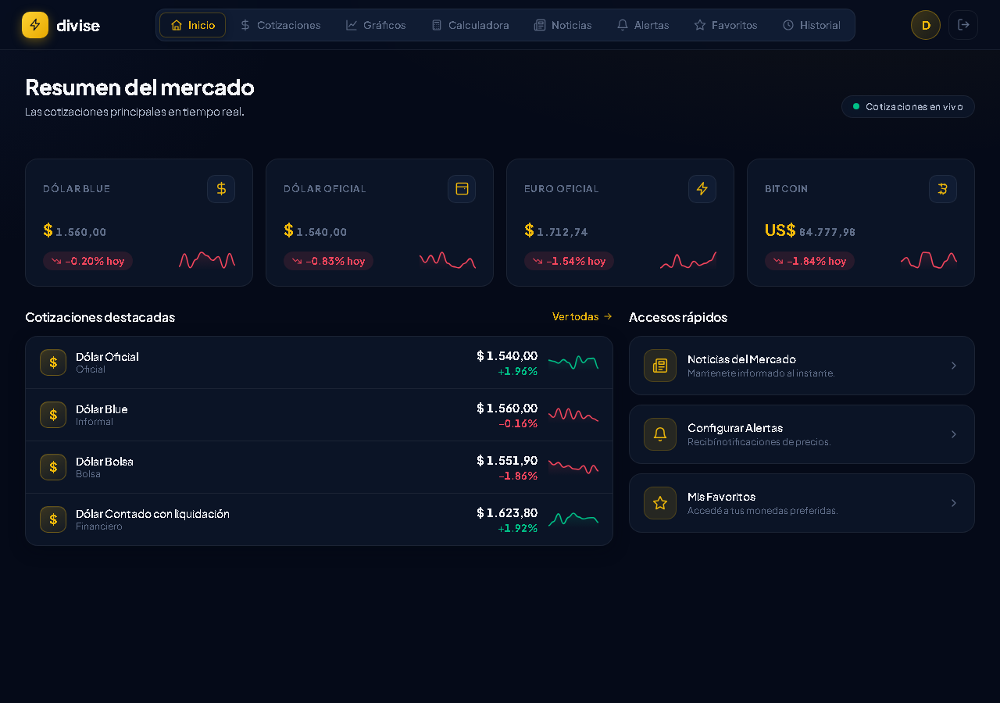
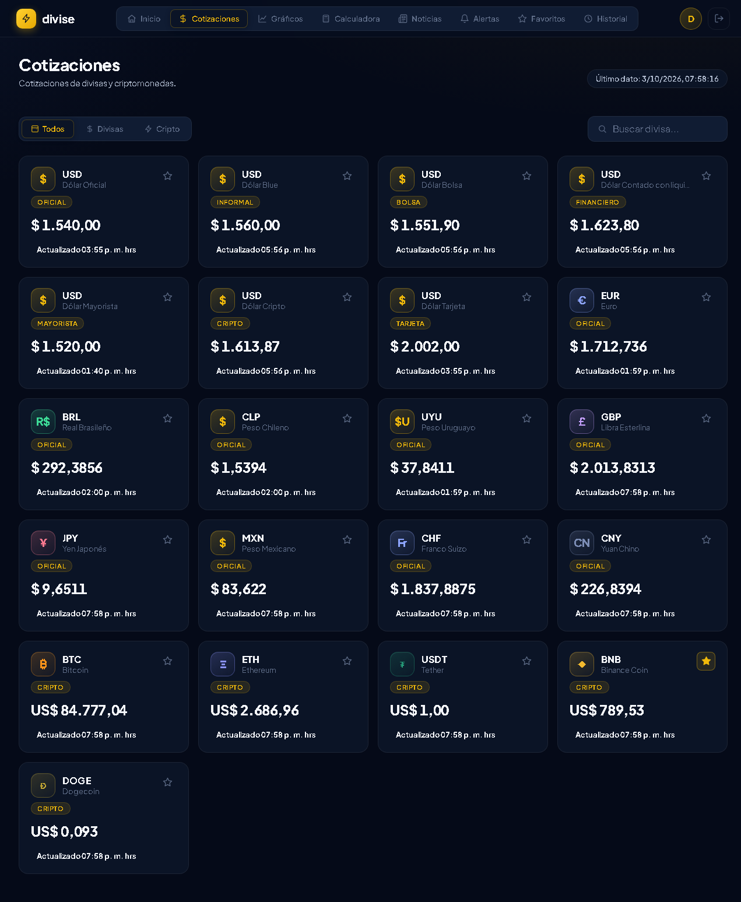
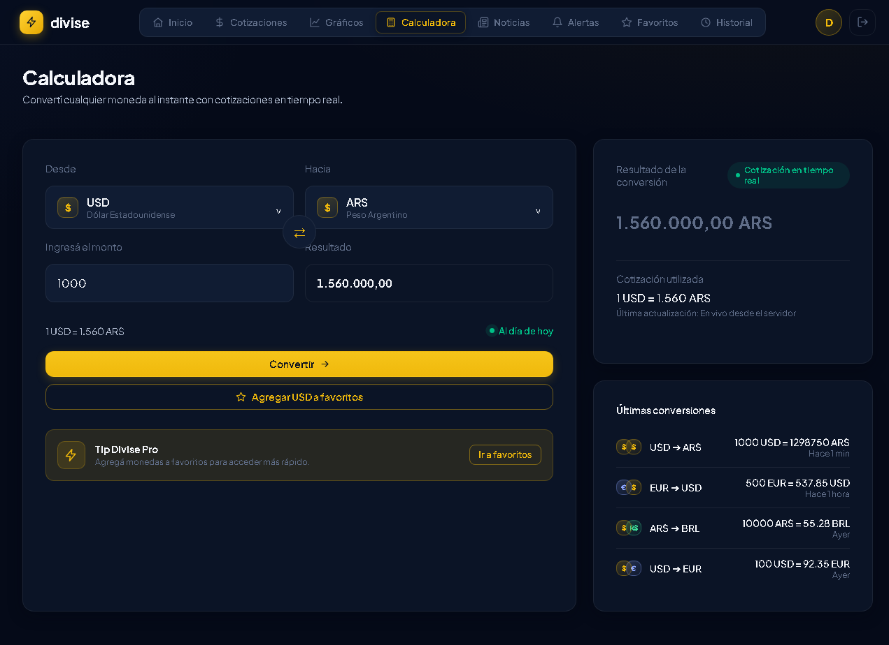
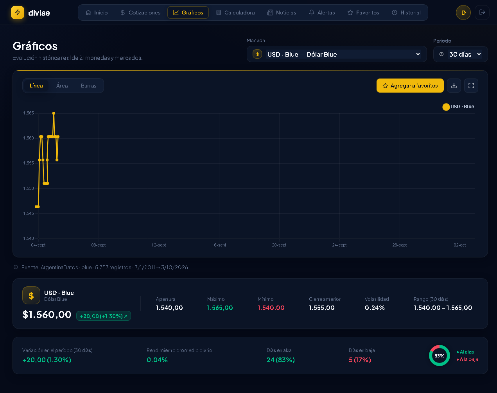
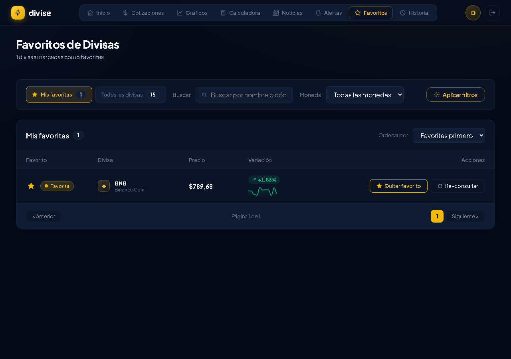
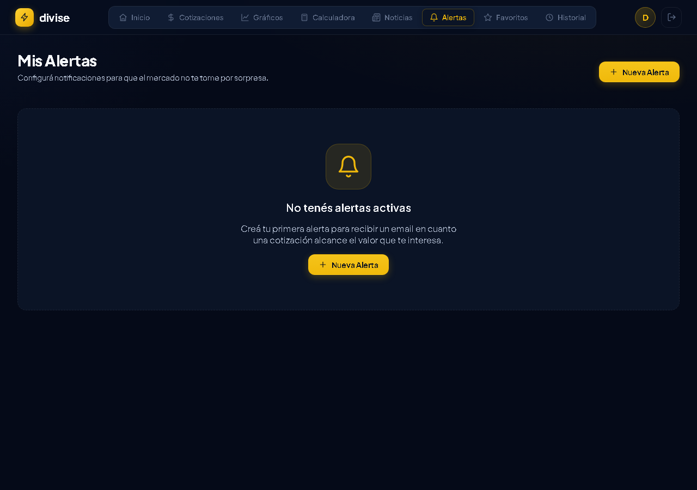
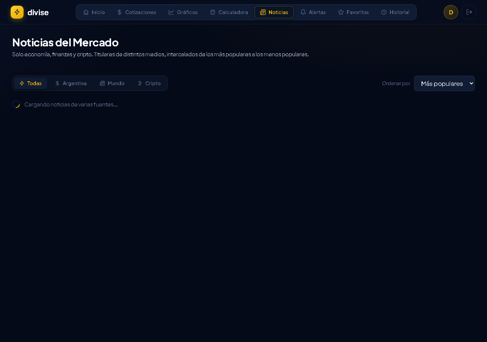
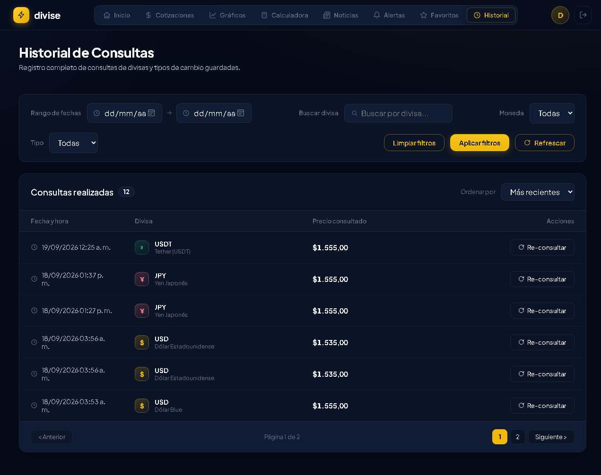
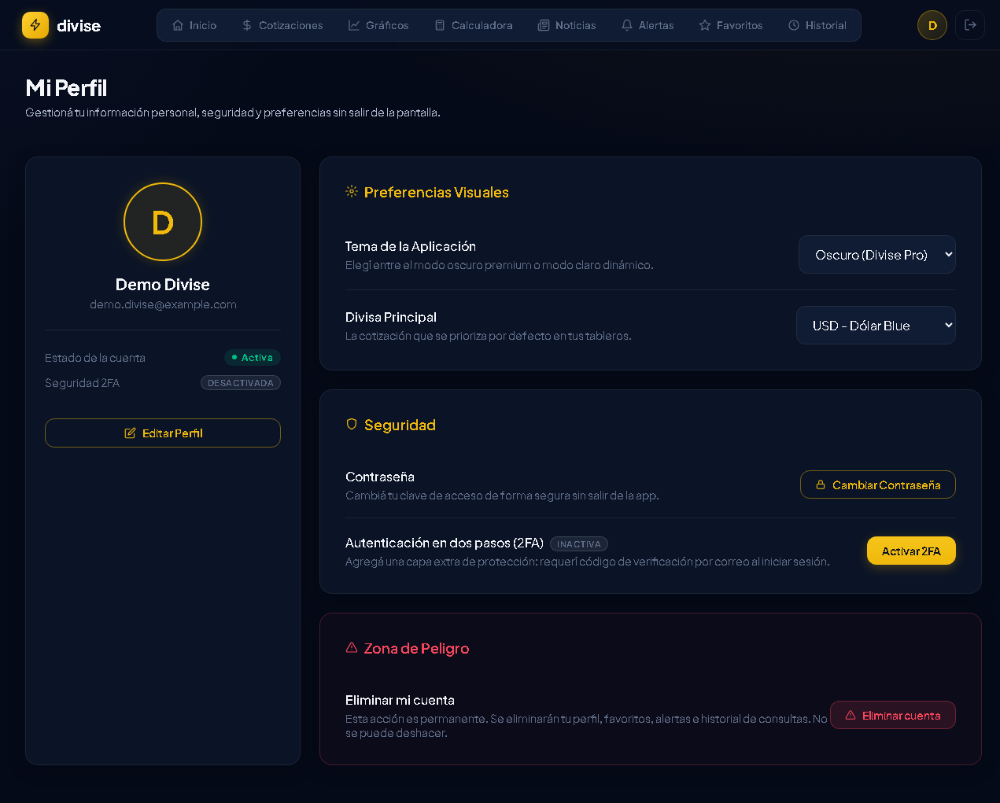

# Manual de Usuario — Dolarito (divise.)
**Versión del manual:** 2.0  
**Última actualización:** 03/10/2026  
**Versión de la aplicación cubierta:** v1.0.0

## Tabla de Contenidos

1. Introducción
2. Requisitos del sistema
3. Primeros pasos
4. Funcionalidades principales
5. Casos de uso comunes
6. Preguntas frecuentes (FAQ)
7. Solución de problemas
8. Contacto y soporte

---

## 1. Introducción

### ¿Qué es Dolarito?
Dolarito (en la interfaz se muestra como `divise.`) es una aplicación web gratuita que junta en un solo lugar las cotizaciones del dólar, las monedas del mundo y las criptomonedas, con valores en tiempo real. Permite ver cómo viene el día (dólar oficial, blue, MEP, tarjeta, etc.), convertir montos con una calculadora, seguir gráficos históricos, armar una lista de favoritos, recibir alertas de precio por correo, leer noticias del mercado y guardar el historial de lo que uno consulta.

### ¿A quién está dirigida?
- **Particulares y ahorristas:** gente que quiere saber cuánto está el dólar para proteger sus ahorros o planificar gastos.
- **Comerciantes y freelancers:** quienes facturan o cobran en moneda extranjera y necesitan presupuestar en pesos.
- **Curiosos del mercado:** gente que quiere mirar la brecha cambiaria o seguir la tendencia de una moneda a lo largo del tiempo.

### ¿Qué problema resuelve?
La información del mercado suele estar fragmentada y desactualizada, y muchas páginas cargan de publicidad. Dolarito centraliza todo en una sola pantalla limpia: valores reales y al instante, conversión de monedas, alertas automáticas y un historial para no perder de vista lo que uno consultó. No hace falta ser experto para usarla.

---

## 2. Requisitos del sistema

Dolarito corre en el navegador: no se instala nada en la computadora.

| Componente | Requisito |
| :--- | :--- |
| Sistemas operativos | Windows 10/11, macOS 11+, Linux, Android 9+, iOS 14+. |
| Navegadores | Chrome, Edge, Firefox, Safari (versiones actuales). |
| Conexión a internet | Sí, para recibir los precios en vivo. Se recomienda una conexión estable. |
| Cuenta de usuario | Se necesita para entrar al panel, guardar favoritos, crear alertas y ver el historial. |
| Permisos especiales | Ninguno. No pide cámara, micrófono ni ubicación. Las alertas y los códigos llegan por correo. |

> Tip: en el celular podés instalarla como una app (PWA). Desde el menú del navegador buscá *"Instalar aplicación"* o *"Agregar a la pantalla principal"* y se abre en pantalla completa, con navegación táctil.

---

## 3. Primeros pasos

### 3.1 Acceso
1. Abrí el navegador y entrá a **https://dolarito.onrender.com**.
2. Comprobá que el navegador muestre el candado de conexión segura (HTTPS).

### 3.2 Registro y creación de cuenta
1. En la pantalla de inicio tocá **"Crear cuenta"**.
2. Cargá tu nombre, un correo válido y una contraseña (mínimo 8 caracteres).
3. Aceptá los términos y confirmá. El sistema te manda un **código de 6 dígitos** al correo.
4. Ingresá el código para activar la cuenta y entrás directo.

> Si el correo no llega en unos segundos, revisá la carpeta de Spam o tocá "Reenviar código".

### 3.3 Inicio de sesión y recuperación de contraseña
1. Escribí tu correo y tu contraseña, y tocá **"Iniciar sesión"**.
2. **Verificación:** si tenés activado el segundo paso (2FA), te llega un código de 6 dígitos al correo. Ingresalo y listo.
3. **¿Olvidaste la contraseña?** Tocá el enlace, poné tu correo y vas a recibir un código de recuperación de 6 dígitos (válido 30 minutos). Con ese código y una contraseña nueva recuperás el acceso.

### 3.4 Recorrido inicial
Al entrar, te encontrás con el panel de **Inicio**. En la parte de arriba está el menú con todos los módulos: Inicio, Cotizaciones, Gráficos, Calculadora, Noticias, Alertas, Favoritos, Historial y Perfil. En el celular, el menú principal está abajo para manejarlo con el pulgar.

---

## 4. Funcionalidades principales

### 4.1 Inicio (panel principal)
**¿Qué hace?** Muestra las 4 cotizaciones más consultadas — Dólar Blue, Dólar Oficial, Euro y Bitcoin — en tarjetas con el precio actualizado, la variación del día y una mini-gráfica de tendencia. También tiene atajos a las cotizaciones completas y a la calculadora.

**¿Cómo se usa?** Entrá y mirá. Las tarjetas se actualizan solas; tocá "Ver todas" para ver el resto de las monedas.

### 4.2 Cotizaciones
**¿Qué hace?** Es el catálogo completo: dólares, monedas del mundo (euro, real, libra, yen, peso uruguayo, etc.) y criptomonedas (BTC, ETH, USDT, BNB, DOGE), con precio de compra y venta y la variación.

**¿Cómo se usa?**
1. Entrá a **Cotizaciones**.
2. Filtrá por *Todas*, *Divisas* o *Cripto*, o buscá por nombre o código (ej. "Real", "BRL", "BTC").
3. Tocá la estrella (★) para guardarla en Favoritos.
4. Tocá una tarjeta para registrar esa consulta en tu historial.

### 4.3 Calculadora
**¿Qué hace?** Convierte un monto de una moneda a otra usando el tipo de cambio del momento, incluso cripto a pesos (hace el cruce vía dólar).

**¿Cómo se usa?**
1. Escribí el monto (ej. 1000).
2. Elegí la moneda de origen y la de destino.
3. Usá el botón ⇄ para invertir el sentido, si hace falta.
4. El resultado aparece al instante con el tipo de cambio aplicado.

### 4.4 Gráficos
**¿Qué hace?** Muestra la evolución real de una moneda en distintos períodos (7 días, 30 días, 1 año, 5 años o toda la serie) y permite comparar dos monedas en el mismo gráfico.

**¿Cómo se usa?** Elegí la divisa, el período y el estilo (línea o área). Si querés, activá "Comparar divisas" para superponer una segunda. Pasá el cursor por el gráfico para ver la fecha y el precio exacto.

### 4.5 Favoritos
**¿Qué hace?** Guarda en tu cuenta las monedas que querés tener siempre a la vista.

**¿Cómo se usa?** Tocá la estrella en cualquier cotización para sumarla o sacarla. En Favoritos podés filtrar por tipo y, con el botón de conversión rápida, mandarla directo a la calculadora.

### 4.6 Alertas
**¿Qué hace?** Vigila una moneda por vos y te avisa por correo cuando supera un precio o cae por debajo de uno que le configuraste.

**¿Cómo se usa?**
1. Entrá a **Alertas** y tocá **"+ Nueva Alerta"**.
2. Elegí la divisa, la condición (*Supera el valor* o *Cae por debajo de*) y el precio límite.
3. Tocá **Guardar Alerta**. No hace falta poner el correo: usa el de tu cuenta. Podés eliminarla cuando quieras.

### 4.7 Noticias
**¿Qué hace?** Reúne titulares de economía y finanzas separados por región (Argentina, Mundo, Cripto) para estar al día sin saltar de página.

**¿Cómo se usa?** Entrá a **Noticias**, filtrá por región y tocá una tarjeta para leer el artículo completo en la fuente original (se abre en una pestaña nueva).

### 4.8 Historial
**¿Qué hace?** Guarda un registro con fecha, hora, moneda y precio de cada cotización que consultaste.

**¿Cómo se usa?** Entrá a **Historial** y filtrá por fechas, por tipo (Fiat/Cripto), por moneda o por palabra. Podés ordenarlo del más reciente al más antiguo y limpiar los filtros cuando quieras.

### 4.9 Perfil
**¿Qué hace?** Te deja manejar tu cuenta: datos personales, apariencia, contraseña, verificación en dos pasos y baja de la cuenta.

**¿Cómo se usa?**
- **Editar perfil:** corregir nombre o correo.
- **Apariencia:** tema oscuro o claro, y elegir la divisa principal que se muestra por defecto.
- **Cambiar contraseña:** poné la actual y la nueva (mínimo 8 caracteres).
- **2FA:** al activarlo, cada inicio de sesión pide un código de 6 dígitos que llega a tu correo.
- **Eliminar cuenta:** escribí **ELIMINAR** en el diálogo de confirmación. Borra todos tus datos de forma permanente.

---

## 5. Casos de uso comunes

- **"Quiero saber cuánto está el dólar blue hoy"** → Entrá y mirá la primera tarjeta del Inicio.
- **"Tengo que cobrar 750 dólares y quiero saber cuánto es en pesos"** → Calculadora: monto 750, origen USD, destino ARS.
- **"Quiero comprar dólar solo si baja de cierto precio"** → Creá una alerta con condición "Cae por debajo de" y el valor que te sirva; te avisa por correo.
- **"Quiero ver cómo estuvo el euro este año"** → Gráficos: elegí Euro y período 1 año.
- **"No quiero estar mirando toda la lista, solo 3 monedas"** → Marcalas con la estrella y trabajá desde Favoritos.

---

## 6. Preguntas frecuentes (FAQ)

| Pregunta | Respuesta |
| :--- | :--- |
| ¿La aplicación es paga? | No. Es gratuita, solo hay que registrarse para guardar favoritos, alertas e historial. |
| ¿Cada cuánto se actualizan los precios? | Se sincronizan en tiempo real con los proveedores. Al lado de las cotizaciones hay una hora de última actualización. |
| ¿Guarda mis operaciones o datos bancarios? | No. Es solo información de cotizaciones. No pedimos datos de tarjeta ni cuentas, y no hacemos ninguna operación real. |
| ¿Cómo convierte Bitcoin a pesos? | Primero pasa el cripto a dólares y después a pesos usando como referencia el tipo de cambio del mercado. |
| ¿Puedo usarla en el celular? | Sí, desde el navegador; y además se puede instalar como app (PWA) tocando "Instalar aplicación" en el menú. |
| ¿Qué pasa con mis datos personales? | Las contraseñas se guardan con hash, el acceso por usuario está aislado en la base y se respeta la Ley 25.326 de Protección de Datos Personales. |

---

## 7. Solución de problemas

| Problema | Posible causa | Solución |
| :--- | :--- | :--- |
| No puedo iniciar sesión | Contraseña mal escrita, o cuenta sin verificar. | Revisá que no esté activado Bloq Mayús. Si olvidaste la clave, usá "¿Olvidaste tu contraseña?". Si la cuenta no está verificada, chequeá el correo. |
| Rechaza el código de verificación / 2FA | Código vencido o mal tipeado. | Usá el código del correo más reciente y toca "Reenviar código" si venció. |
| Las cotizaciones quedan en 0 o no cambian | Sin internet o la fuente de datos está de mantenimiento. | Comprobá la conexión y recargá (F5). Si la fuente falla, la app muestra el último valor guardado. |
| El gráfico no muestra datos | Par sin historial para ese rango. | Probá otro período o un par más común (USD/ARS, EUR/ARS, BTC). |
| No me llegan las alertas | El precio todavía no llegó al límite, o el correo cayó en Spam. | Verificá que la alerta figure como activa y revisá la carpeta de no deseado. |
| No me deja eliminar la cuenta | La palabra de confirmación mal escrita. | Escribí EXACTAMENTE **ELIMINAR** en mayúsculas. |

---

## 8. Contacto y soporte

- **Correo de soporte:** divise.grupo6@gmail.com
- **Plataforma y documentación:** https://dolarito.onrender.com
- **Horario de atención:** lunes a viernes, de 09:00 a 18:00 (GMT-3).
- **Respuesta:** en general, dentro de las 24 horas hábiles.

> Al escribir, contá qué estabas haciendo, a qué hora y qué mensaje viste en pantalla. Así resolvemos más rápido.

---

*Dolarito (divise.) — Grupo 6 · ESTFA 2026 · Manual de usuario v2.0*